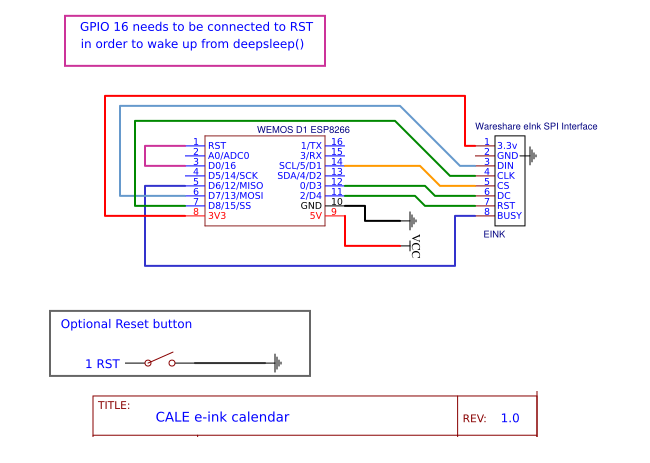

# CALE E-ink calendar

A very easy and straight-forward Eink calendar. 
At the moment just has 3 simple options:

1. Renders a screenshot of a webpage (Calendar if you point it to a calendar page)
2. Renders a free title + text
3. Cleans screen

UX Preview when the Espressif board is online and you access the IP address:

If you have an OS with Bonjour enabled multicast DNS discovery OS like mac or linux it should be possible to access also browsing: calendar.local

### Our approach to make an easy E-Ink calendar

- A screenshot to BMP endpoint that prints a webpage with the contents you need displayed on Eink
- The Firmware driving the Eink display will wake up every morning or every 2 hours and read this screenshot. Then it will stay in deep sleep mode, consuming 1 miliamper from the battery, until it wakes up again and repeats the loop. 
- Only optionally it will stay connected and hear any requests for some minutes in case you need to render a custom website or a free text in the display. Otherwise it could go to sleep as soon as it renders the calendar or desired webpage.

There is a PHP example to do this in the directory /screenshot. The idea is to render the display and go to sleep to consume as little as possible and extend battery life.

### Screenshot tool

The [screenshot tool](screenshot) needs a webserver with image magick installed as a PHP extension since converts the website screenshot into a BMP monochrome image.
It accepts as GET variables:

**u** = URL of the website you want to render

**z** = zoom factor (optional is 0.8 as default) Ex: .5 will scale it to 50%

An example call will look like: yourwebsite.com/screenshot/?u=https//nytimes.com

The idea is very simple, if you build a page that reads your calendar, and then point this u variable to the URL then you can refresh your Eink display with this Firmware without needing to parse any JSON or XML from C. Which can be done but is a daunting task. And this way you can also easily the design and build it with any HTML and CSS combination you desire.

### Simple configuration

Just rename lib/Config/Config.h.dist to Config.h
and fill it with your WiFi name and password

If you want to enable deepsleep to power your calendar with batteries, then uncomment the line:

    //#define DEEPSLEEP_ENABLED

Note that if you want to use the web interface you cannot use it while the ESP is on deepsleep. That is why there is another setting in Config.h called:

    #define SLEEP_AFTER_SECONDS 300 

Then it will be as default 5 minutes hearing if you want to send a custom screenshot or text message and then go to sleep one hour. This is not in the config, if you want to update it just change this line:

    ESP.deepSleep(3600e6);  // 3600 = 1 hour in seconds

Prepare any page that will render your calendar from any source (Google/Exchange) or to render your favourite newspaper homepage every morning editing this String in Config:

    calendarUrl
    
UPDATE: There will be soon a ESP32 version where you can save WiFi credentials using Bluetooth.

### Google calendar Oauth example

Please read the instructions left at [screenshot/g_calendar](screenshot/g_calendar) to have a very easy and configurable google calendar reader online. 
Note that if you just want to have it at home, you don't need to put it online and public to the world, you can just keep it in a local machine or any Raspberry PI local server. 

http://twitter.com/martinfasani

### Schematics

